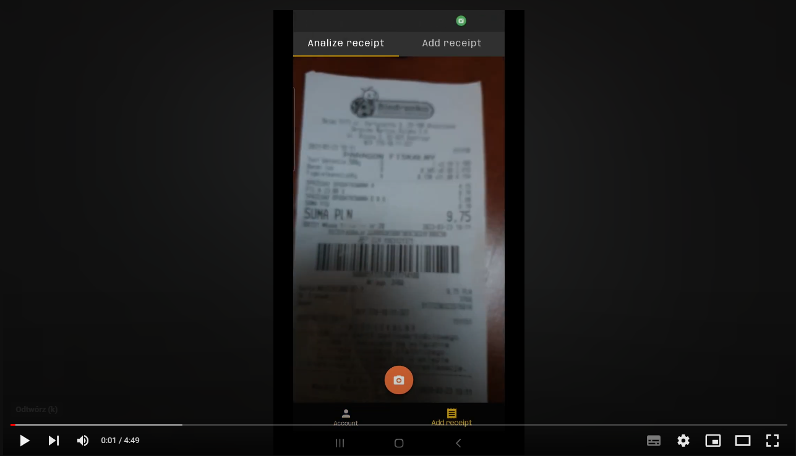
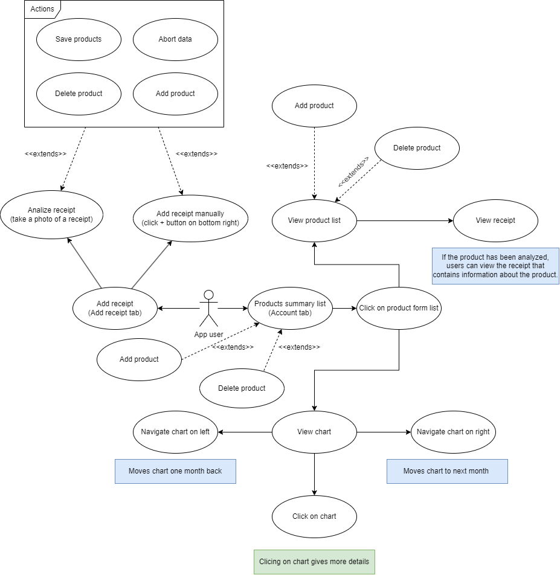

# Money manager mobile

I developed this project over the course of my last two semesters in college.  
The primary objective of this project was to create an application that enables users to track product prices from various markets.  
The video you are about to watch is a concise 5-minute presentation outlining the flow of my project.  

## Use case

## Features

* The application is connected to the REST API. You can find more information about the services it provides under the [REPOZITORY](https://github.com/Hajdukson/enginering-project-web)
* CRUD operations on products
* The application allows users to take photos of receipts, which are then processed by Back-End service to fetch products automatically. Additionally, users can also add products manually if needed
* View a summary list that shows the percentage increase in product prices
* User can filter every list over the application. Each list has a different filter implementaion

